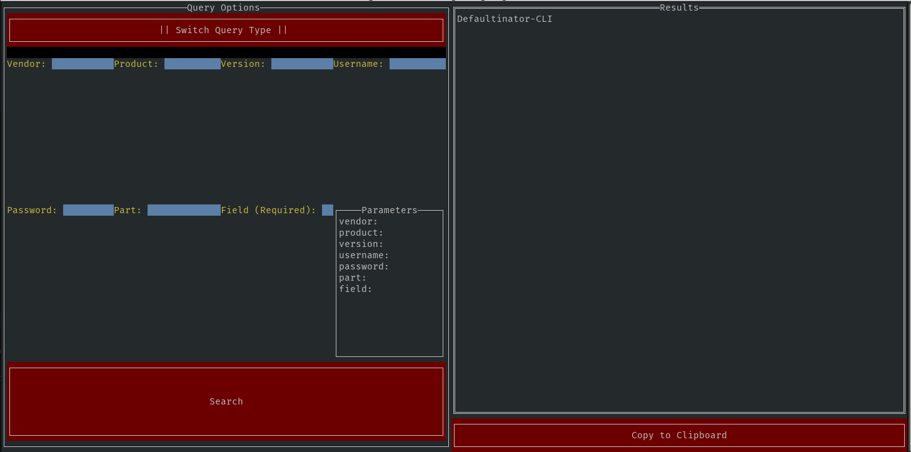

# Defaultinator-CLI
### Why would you have it set to that?

Basically, it's a command line interface for Defaultinator. Will only retrieve up to 10 pages of results. On first use 
the api key must be supplied, where it'll be saved in the file ".defaultinator.ini" in your home directory. 
On subsequent usage, it will be retrieved from the ini file unless a new API key is supplied

At this time it is a "read-only" interface, but it will be expanded in the future.

## Usage

```
  -apiKey 
        api key
    -baseUrl 
        Change to use a different base url
  -field string <REQUIRED for Typeahead>
        search field
  -output
        output file
  -part 
        search part
  -password 
        search password
  -product 
        search product
  -tui
        launch the tui
  -type 
        Choose Typeahead or Search 
  -username
        search username
  -vendor
        search vendor
```

## TUI Interface 
